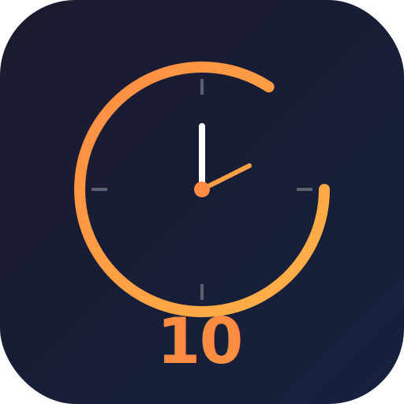

<p align="center">
  
</p>

<h1 align="center">L10 Meeting Manager</h1>

A web app for running EOS L10 meetings. Runs entirely in the browser with no server required — data is stored directly on your computer in a folder of your choosing as Excel files. This app is simply a viewer for Excel-based L10 Meetings.

## Features

- Department management with people lists
- L10 meeting workflow (segue, scorecard, OKR review, headlines, to-do review, IDS, conclude)
- Scorecard and OKR tracking across meetings
- Auto-save to Excel files on your local filesystem
- Custom company logo support
- Works with any cloud-synced folder (OneDrive, Google Drive, Dropbox)
- Allows for running a one-time meeting and exporting to CSV
- Works on mobile (only for one-time meetings)

## Requirements

- A Chromium-based browser (Chrome, Edge, Opera)

## Development

```
npm install
npm run dev
```

Open `http://localhost:5173/CompanyTools/`.

## Production Build

```
npm run build
```

Deploy the `dist/` folder to any static host (GitHub Pages, Vercel, Netlify, etc.).

## How It Works

On first visit, the app asks you to select a folder on your computer (or run a one-time meeting). If a folder is selected, all meeting data (Excel files, people lists, logo) is stored directly in that folder. The folder choice is remembered in the browser via IndexedDB so you only need to pick it once. It's advised to pick a folder that is hosted on a file-sharing service such as Google Drive or OneDrive so the data can be shared with the relevant people on your team.
